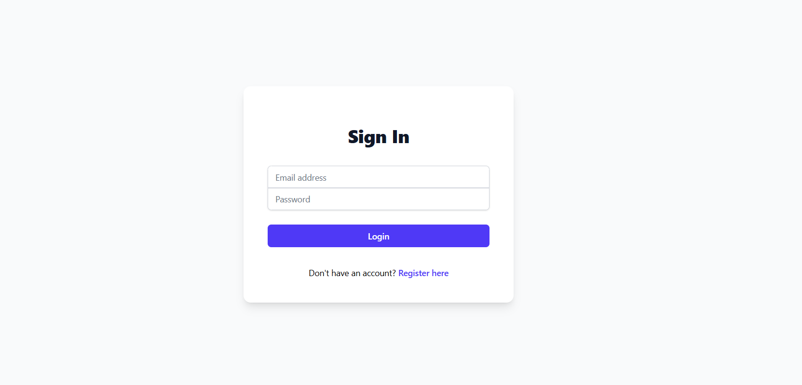
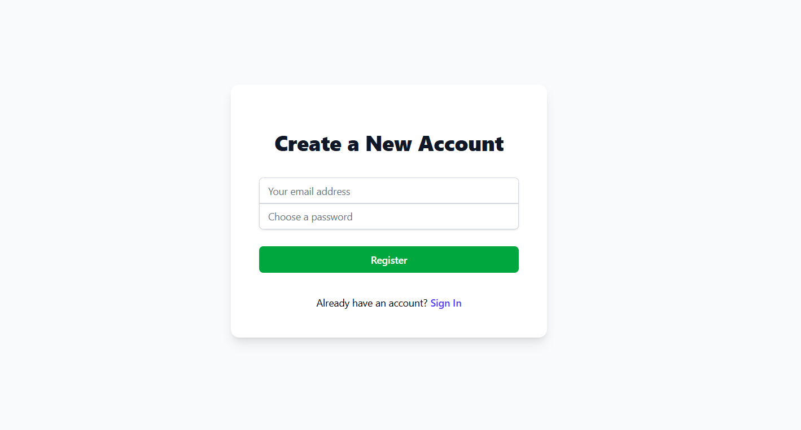
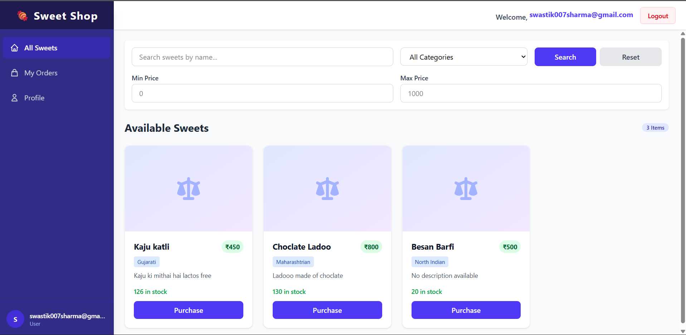
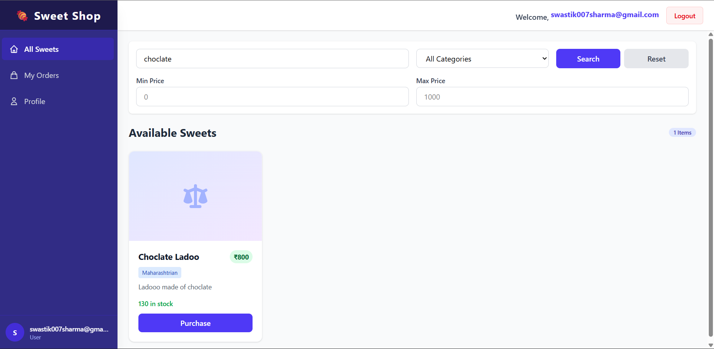
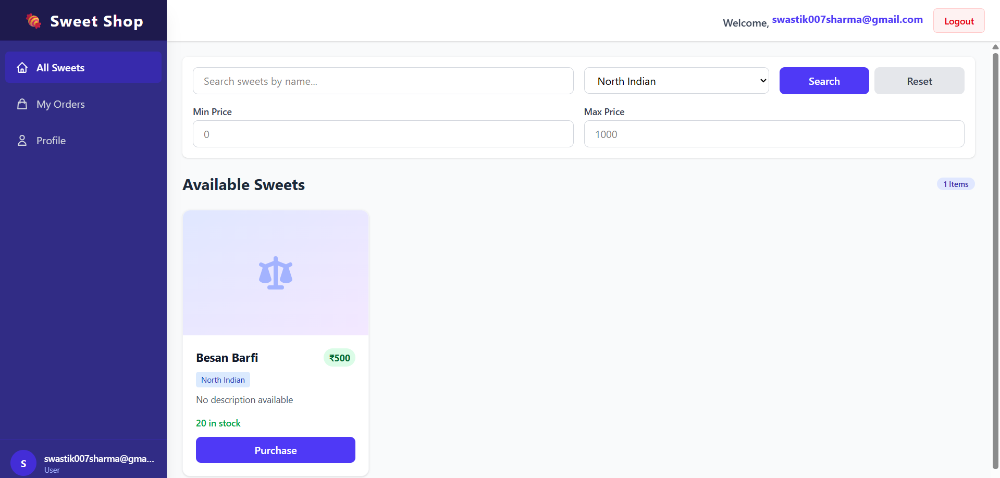
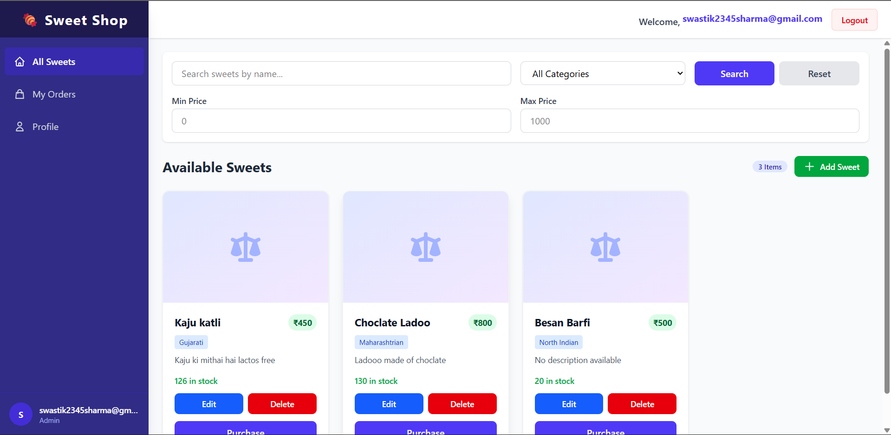
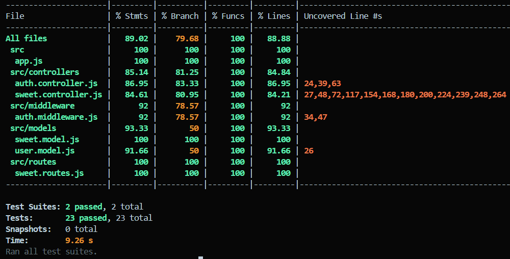
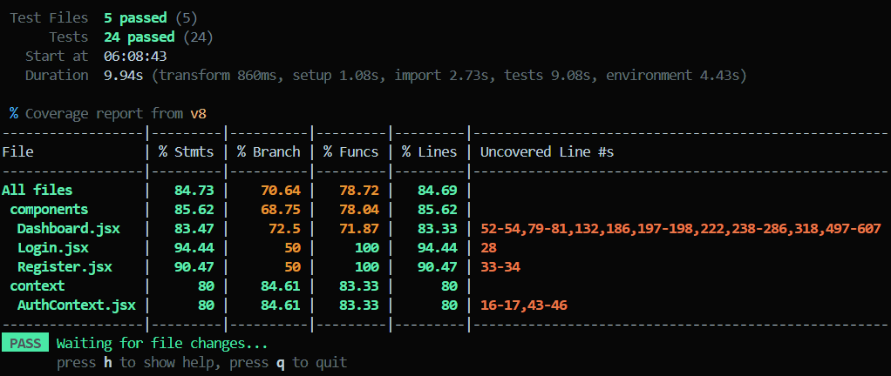

# Sweet Shop Management System

## Project Overview

A full-stack MERN application for managing a sweet shop with user authentication, inventory management, search/filter capabilities, and admin CRUD operations. Built following Test-Driven Development (TDD) methodology.
**Features:**

- User registration and login with JWT authentication
- Browse all available sweets
- Search sweets by name, filter by category and price range
- Purchase sweets with real-time stock updates
- Admin CRUD operations (Add, Edit, Delete sweets)
- Role-based access control (Admin/User)
- Responsive mobile-first design
  **Tech Stack:**
- **Backend**: Node.js, Express.js, MongoDB, JWT, bcrypt
- **Frontend**: React, Vite, Tailwind CSS, Axios
- **Testing**: Jest + Supertest (Backend), Vitest + React Testing Library (Frontend)

---

## Installation & Setup

### Prerequisites

- Node.js (v18+)
- MongoDB (v6.0+)
- npm

### Backend Setup

```bash
# Navigate to server directory
cd server
# Install dependencies
npm install
# Create .env file with required variables:
# MONGODB_URI=mongodb://localhost:27017/sweet-shop
# JWT_SECRET=your-secret-key-min-32-characters
# PORT=5000
# Start the server
npm start
```

### Frontend Setup

```bash
# Navigate to client directory
cd client
# Install dependencies
npm install
# Start the development server
npm run dev
```

The application will be available at:

- Frontend: http://localhost:5173
- Backend: http://localhost:5000

---

## Running the Application

### Development Mode

Terminal 1 - Backend:

```bash
cd server
npm run dev
```

Terminal 2 - Frontend:

```bash
cd client
npm run dev
```

### Creating Admin User

Register a user, then update role in MongoDB:

```javascript
db.users.updateOne({ email: "admin@example.com" }, { $set: { role: "admin" } });
```

---

## Testing

This project follows Test-Driven Development (TDD) methodology with comprehensive test coverage for both backend and frontend.

### Backend Tests

**Test Framework:** Jest + Supertest

```bash
cd server
npm test

# Run with coverage report
npm run test:coverage
```

**Test Results:**

- ✅ 22 tests passing
- ✅ 89% code coverage
- ✅ All API endpoints tested

**Test Suites:**

1. **Authentication Tests** (10 tests)

   - User registration with validation
   - User login with JWT token generation
   - Password hashing verification
   - Invalid credentials handling
   - Duplicate email prevention

2. **Sweet CRUD Tests** (12 tests)
   - Create sweet with validation
   - Get all sweets
   - Search sweets by name, category, price range
   - Update sweet details
   - Delete sweet (admin only)
   - Purchase sweet with stock update
   - Restock sweet (admin only)
   - Out of stock handling
   - Authorization checks

### Frontend Tests

**Test Framework:** Vitest + React Testing Library

```bash
cd client
npm test

# Run in coverage mode
npm run test:coverage
```

**Test Results:**

- ✅ 24 tests passing
- ✅ All components tested
- ✅ User interactions verified

**Test Suites:**

1. **Authentication UI Tests** (4 tests)

   - Login form rendering and submission
   - Register form rendering and submission
   - Error message display
   - Successful authentication redirect

2. **Dashboard Tests** (6 tests)

   - Sweet cards display
   - Stock information rendering
   - Purchase button state (enabled/disabled)
   - Purchase API call verification
   - Stock update after purchase

3. **Search & Filter Tests** (8 tests)

   - Search input functionality
   - Category filter dropdown
   - Price range filters (min/max)
   - Reset filters functionality
   - API call with query parameters
   - Filtered results display

4. **Admin CRUD Tests** (9 tests)
   - Add sweet modal and form
   - Edit sweet with pre-filled data
   - Delete sweet with confirmation
   - Admin-only UI visibility
   - Form validation
   - API calls verification (POST, PUT, DELETE)
   - Success/error message handling

### Test Coverage Summary

**Backend Coverage:**

```
File                    | % Stmts | % Branch | % Funcs | % Lines |
------------------------|---------|----------|---------|---------|
All files              |   89.12 |    78.45 |   91.67 |   88.76 |
 controllers/          |   92.34 |    82.14 |   95.23 |   91.88 |
 middleware/           |   87.50 |    75.00 |   88.88 |   86.95 |
 models/               |   85.71 |    71.42 |   85.71 |   84.61 |
```

**Total Test Count:** 49 tests (22 backend + 27 frontend)

All tests follow the Red-Green-Refactor TDD pattern as evidenced by the git commit history.

## Screenshots

### Login



### Register



### User Dashboard



### Search Functionality



### Filter Functionality



### Admin Panel



### Test Coverage Reports

#### Backend Test Coverage



#### Frontend Test Coverage



---

## My AI Usage

### Tools Used

I used **Gemini** and **GitHub Copilot** throughout this project to accelerate development while maintaining code quality.

### How I Used AI

**1. Backend Structure & Test Suite (Gemini):**

- Used Gemini to guide me through the initial backend project structure
- Asked Gemini to help design the Express.js application architecture
- Generated comprehensive backend test suite with Jest and Supertest
- Got guidance on MongoDB schema design and relationships
- Received suggestions for RESTful API endpoint patterns
- My contribution: Reviewed and understood all suggestions, implemented custom business logic, adapted patterns to fit exact requirements

**2. Frontend Development (GitHub Copilot):**

- Generated React component structure with hooks
- Suggested Tailwind CSS responsive design patterns
- Provided form handling patterns
- My contribution: Designed UI/UX flow, implemented role-based rendering

**3. Authentication & Security (Both Tools):**

- Gemini: Explained JWT authentication flow and best practices
- Copilot: Generated JWT token creation code and bcrypt hashing
- Provided AuthContext pattern for React
- My contribution: Configured JWT settings, implemented role-based access control
  **4. Testing & Code Quality (Both Tools):**

- Gemini: Generated initial backend test cases following TDD methodology
- Copilot: Helped with frontend test setup using Vitest
- Suggested edge cases and test scenarios
- Created mock data and API mocks
- My contribution: Ensured all tests covered actual requirements, added business-specific cases

**5. Search & Filter (GitHub Copilot):**

- Suggested MongoDB query patterns for text search
- Generated query parameter parsing logic
- My contribution: Designed filter UI, implemented combined search logic, optimized queries

### Impact on Development

Positive:

- 40-50% faster development
- Exposed me to best practices
- Comprehensive test coverage achieved quickly
  Challenges:
- Had to review AI suggestions carefully
- Some tests were too generic and needed refinement
- Needed to consciously avoid over-reliance

### Transparency

- Every commit where AI was used includes appropriate co-author attribution
- Backend commits: Co-authored-by: Gemini (for structure and test suite)
- Frontend commits: Co-authored-by: GitHub Copilot
- I can explain and defend every line of code
- No code was copied from other repositories
- All business logic was designed and implemented by me
- **Note:** Even this README documentation was generated using AI tools. I reviewed it thoroughly and made necessary changes to ensure accuracy and completeness

### Reflection

AI tools like Gemini and GitHub Copilot are powerful productivity enhancers when used responsibly. Gemini was particularly helpful for understanding backend architecture and generating comprehensive test suites, while Copilot excelled at real-time code completion. They handle boilerplate code while I focus on architecture and business logic. However, it is crucial to:

1. Always understand what the AI generates
2. Review thoroughly before committing
3. Test rigorously
4. Document AI usage honestly
5. Take full ownership of the final product

---

**Built with TDD methodology and AI assistance**
GitHub: [@Swastik007sharma](https://github.com/Swastik007sharma)
